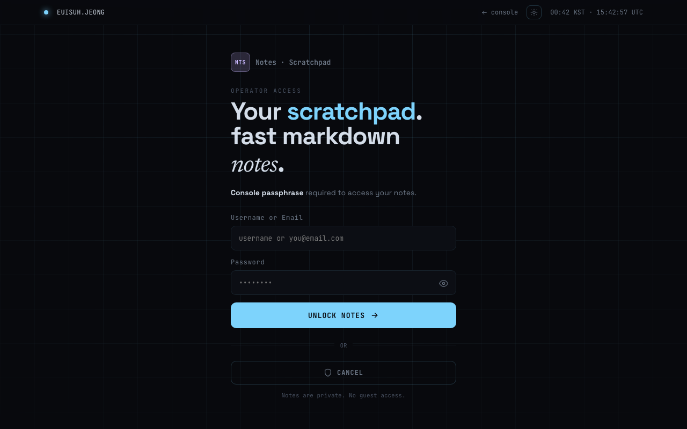
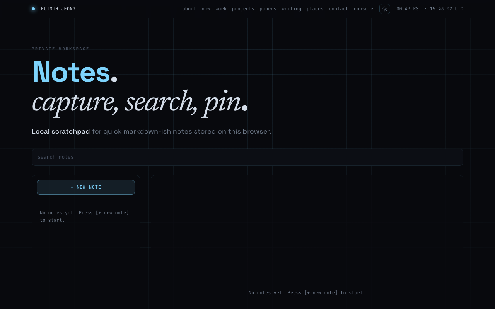

# notes

A local-first markdown scratchpad. Notes live in your browser's `localStorage` — no server, no sync, no accounts.

**Live:** [uiseoya.com/credential?service=notes](https://uiseoya.com/credential?service=notes)

---

## Screenshots

| Auth gate | Notes app |
|-----------|-----------|
|  |  |

---

## Features

- Create, edit, delete, and pin notes
- Full-text search across title and body
- Auto-save with 800 ms debounce, flush on page unload
- Word count and relative timestamps
- Pinned notes sort to top
- Dark / light theme toggle

---

## Stack

| Layer | Technology |
|-------|-----------|
| Frontend | Vanilla HTML + React 18 (UMD) + Babel standalone — no build step |
| Styles | CSS custom properties, dark/light themes |
| Auth backend | Flask 3 + Gunicorn (`POST /keyring/api/auth`) |
| Server | nginx:alpine |
| Container | Docker + Docker Compose |

---

## How it works

```
Browser
  └─ /credential?service=notes   ← auth gate
       POST /keyring/api/auth     ← nginx → Flask backend
       200 OK
       └─ /notes                  ← notes app
            localStorage['ej_notes']  ← all note data (never leaves browser)
```

---

## Deploy

### Prerequisites

- Docker + Docker Compose

### Steps

```bash
git clone https://github.com/euisuh/notes.git
cd notes
cp .env.example .env
# Edit .env: set KEYRING_CREDENTIAL=your@email.com:yourpassword
docker compose up -d --build
```

Runs on `127.0.0.1:8088` by default. Reverse-proxy through nginx or nginx-proxy-manager for production TLS.

### Environment variables

| Variable | Description | Default |
|----------|-------------|---------|
| `KEYRING_CREDENTIAL` | Login credential (`identifier:password`) | `you@email.com:changeme` |

### Health check

```bash
curl http://localhost:8088/keyring/api/health
# {"status": "ok"}
```

### Local dev (no Docker)

```bash
python3 -m http.server 8080 -d public
# Visit http://localhost:8080/notes
# Auth check will fail without backend — open notes directly: http://localhost:8080/notes/index.html
```

---

## Storage

Notes are stored as a JSON array in `localStorage['ej_notes']`:

```json
[
  {
    "id": "uuid",
    "title": "string",
    "body": "string",
    "pinned": false,
    "createdAt": "ISO 8601",
    "updatedAt": "ISO 8601"
  }
]
```

On parse failure, the corrupt payload is backed up to `ej_notes_corrupt_<timestamp>` before reset.

---

## Structure

```
public/
  notes/
    index.html          # Notes app shell (self-contained CSS + fonts)
  credential/
    index.html          # Auth gate shell
  notes-app.jsx         # Full notes app
  credential-app.jsx    # Auth gate (notes service only)
  favicon.ico / favicon.png / robots.txt
backend/
  app.py                # Flask auth endpoint (POST /keyring/api/auth)
  requirements.txt
  Dockerfile
nginx.conf              # Routes: /notes, /credential, /keyring/api/
Dockerfile              # nginx image
docker-compose.yml
.env.example
```

---

## Security notes

- Notes are stored unencrypted in `localStorage`. Access is gated by the credential check; note content never leaves the browser.
- The Flask auth service reads credentials from an environment variable only — no disk, no database.
- nginx sends `X-Frame-Options`, `X-Content-Type-Options`, and `Referrer-Policy` headers on all responses.
- The credential gate is marked `noindex, nofollow`. `robots.txt` disallows all crawlers.

---

## License

MIT
